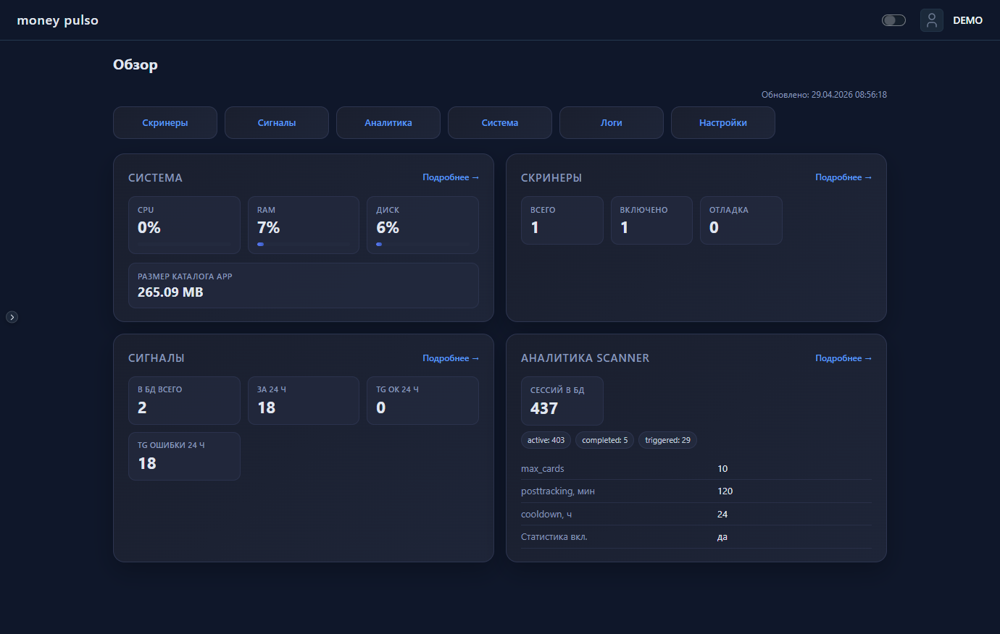
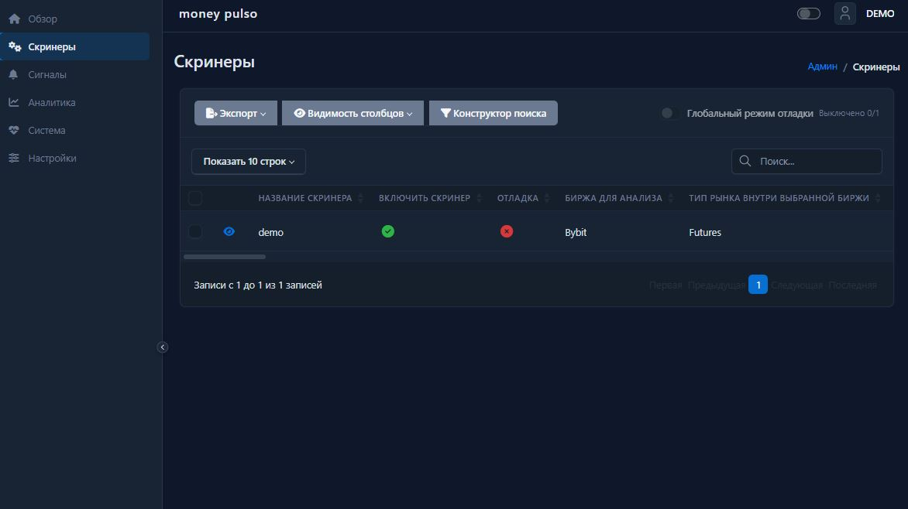
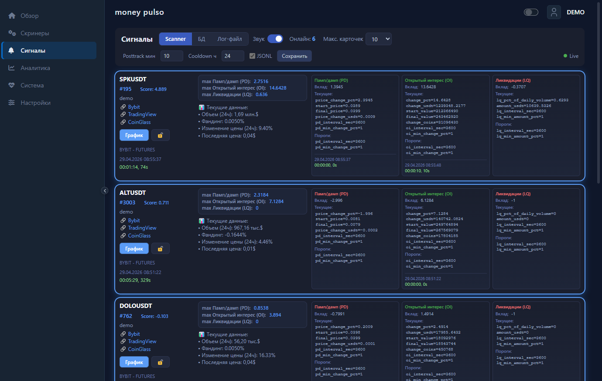
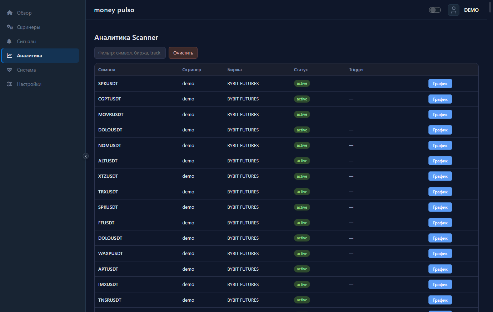
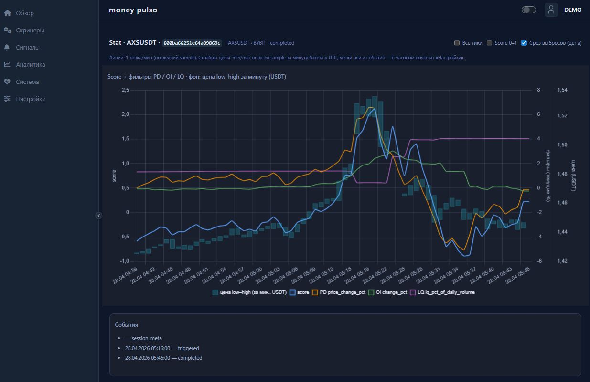

# Money Pulso

Единая **панель скрининга крипторынка**: правила отбора инструментов, поток сигналов и аналитика сессий Scanner — без отдельных скриптов для каждого сценария.

[](https://www.python.org/)
[](https://fastapi.tiangolo.com/)
[](https://www.postgresql.org/)
[](https://jowilf.github.io/starlette-admin/)
[](https://docs.docker.com/compose/)

## Зачем это нужно

- Отбор пар по настраиваемым фильтрам в скринерах (деривативы: открытый интерес, фандинг, ликвидации и др.).
- Уведомления о срабатываниях в **Telegram** и журнал в **PostgreSQL**.
- **Веб-админка**: скринеры, карточки сигналов в реальном времени, мониторинг и **аналитика Scanner** с переходом к статистике по символу.
- Фоновые задачи без ручного опроса биржевых API в интерфейсе. Не требуются API ключи криптобирж.

## Скриншоты интерфейса

### Обзор



Дашборд со сводкой по системе, скринерам, сигналам и сессиям Scanner.

### Скринеры



Управление правилами и параметрами подключённых скринеров.

### Сигналы



Поток срабатываний на основе активных фильтров.

### Аналитика Scanner



Таблица сессий с переходом к подробному графику по символу.

### Статистика по символу



Страница статистики: временные ряды score и фильтров поверх диапазона цены по минутным бакетам.

## Быстрый старт

Из каталога **`app/`** (рядом с `docker-compose.yaml`):

```bash
docker compose up --build
```

Остановка: `docker compose down`. Переменные окружения — файл **`.env`** в `app/`; описание переменных — **[`.env.example`](.env.example)**

После запуска: **`http://localhost:8000/admin/`**

## Безопасность

- Секреты (боты, БД, ключ подписи сессии) задаются только через окружение; реальные значения не коммитить.
- Публичный репозиторий не заменяет модель угроз продакшена: ограничивайте доступ к админке и БД на сетевом уровне.

## Отказ от ответственности

Сигналы и данные в интерфейсе — **не инвестиционная рекомендация**, а техническое уведомление о выполнении настроенных вами правил. Решения по рискам принимаете вы.

## Лицензия

В корне репозитория файл лицензии может отсутствовать — условия использования уточняйте у владельца проекта.

## Миграции БД

В контейнере при старте выполняется `alembic upgrade head`. Локально из `app/`: `uv run alembic upgrade head`.
