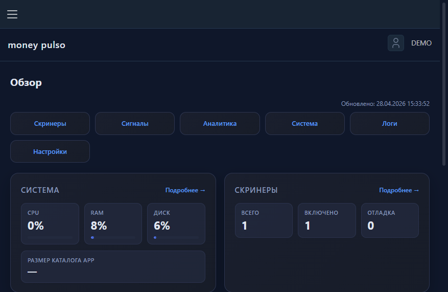
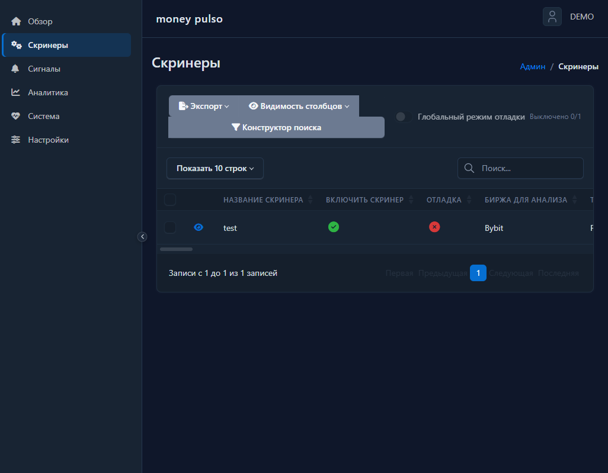
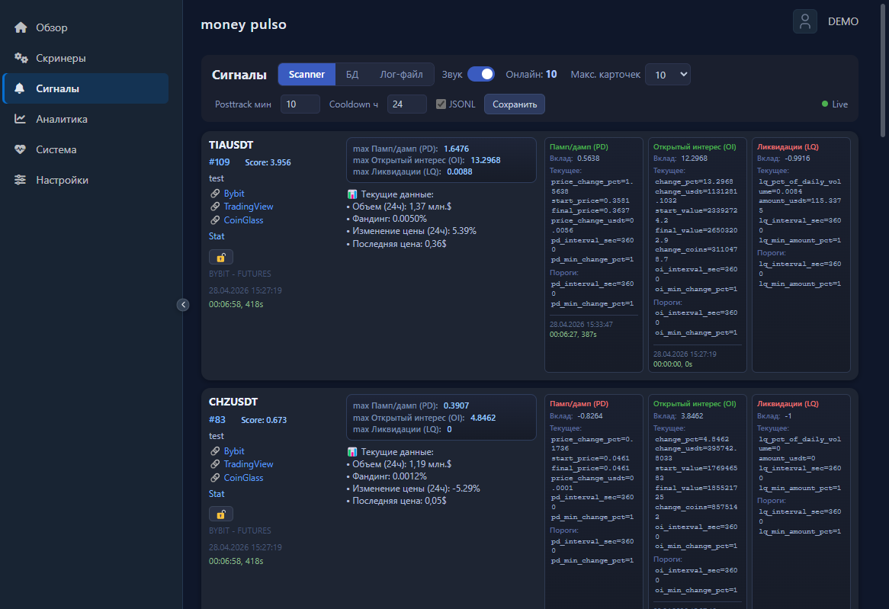
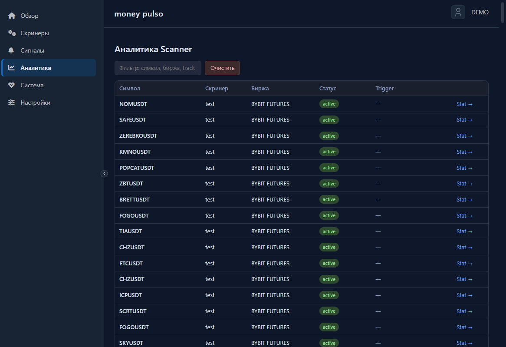

# Money Pulso

**Скрининг крипторынка и уведомления** — единая панель для правил отбора, потока сигналов и разбора контекста по инструментам.

[](https://www.python.org/)
[](https://fastapi.tiangolo.com/)
[](https://www.postgresql.org/)
[](https://docs.docker.com/compose/)

## Зачем это нужно

- Отбор инструментов по настраиваемым условиям (в т.ч. деривативы: OI, фандинг, ликвидации — где применимо).
- Доставка срабатываний в **Telegram** и журнал в БД.
- **Админка** для скринеров, просмотра сигналов и обзора состояния системы.
- **Аналитика Scanner** — сессии и переход к детальной статистике по символу.
- Фоновый сбор рыночных данных и проверка фильтров без ручного опроса API.

## Скриншоты

| Обзор | Скринеры |
|:---:|:---:|
|  |  |

| Сигналы | Аналитика Scanner |
|:---:|:---:|
|  |  |

## Быстрый старт

Из каталога **`app/`** (рядом с `docker-compose.yaml`):

```bash
docker compose up --build
```

Остановка: `docker compose down`. Все параметры окружения — в **`.env`**; перечень переменных и смысл полей — в **[`.env.example`](.env.example)**.

После запуска админка: **`http://localhost:<APP_PORT>/admin/`** (страница входа: `/admin/login`). Полная установка, сценарии и оглавление документации — **[`docs/README.md`](docs/README.md)**.

## Документация

| Раздел | Ссылка |
|--------|--------|
| Оглавление и руководство | [`docs/README.md`](docs/README.md) |
| Архитектура | [`docs/ARCHITECTURE.md`](docs/ARCHITECTURE.md) |
| История изменений | [`docs/CHANGELOG.md`](docs/CHANGELOG.md) |
| Участие и окружение разработчика | [`docs/CONTRIBUTING.md`](docs/CONTRIBUTING.md) |
| Типовые сбои | [`docs/troubleshooting.md`](docs/troubleshooting.md) |

<<<<<<< HEAD
## Безопасность

- Секреты (боты, БД, ключи шифрования сессии) задаются только через **окружение**, не коммитьте реальные значения.
- Публичный репозиторий не заменяет модель угроз для продакшена: ограничивайте доступ к админке и БД на сетевом уровне.

## Отказ от ответственности

Сигналы и данные в интерфейсе — **не инвестиционная рекомендация**, а техническое уведомление о выполнении ваших правил. Решения по рискам принимаете вы.

## Лицензия

В корне репозитория файл лицензии может отсутствовать — условия использования уточняйте у владельца проекта.
=======
Правила ведения доков: [SYSTEM_PROMPT.MD](docs/SYSTEM_PROMPT.MD).
>>>>>>> dev

## Миграции БД

В контейнере при старте выполняется `alembic upgrade head`. Локально из `app/`: `uv run alembic upgrade head`.
